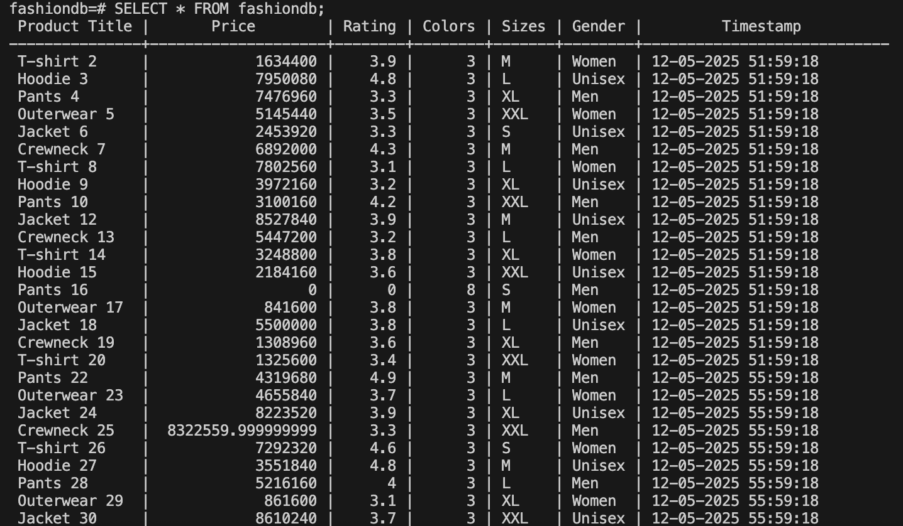

# ETL Pipeline

## Extract

## Transform

## Load

### CSV
Bisa dilihat pada file bernama [`Fashions_details_data.csv`](./Fashions_details_data.csv)

### PostgreSQL

### Google Spread Sheets
Bisa masuk ke link [berikut](https://docs.google.com/spreadsheets/d/1FTkvlwCWrMj_sgFm6b9QUIk5IFJArNfbRtXrTobGeV0/edit?usp=sharing)